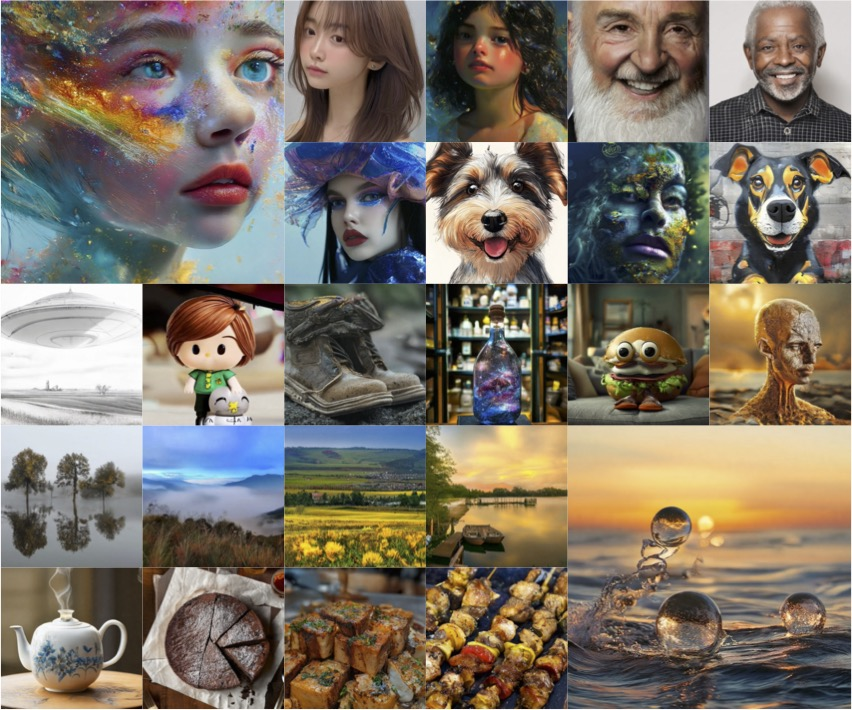

# High-Resolution Image Synthesis via Next-Token Prediction.

[paper](https://arxiv.org/pdf/2411.14808)

Denoising with a Joint-Embedding Predictive Architecture (D-JEPA), an autoregressive model, has demonstrated outstanding performance in class-conditional image generation. However, the application of next-token prediction in high-resolution text-to-image generation remains under explored. In this paper, we introduce D-JEPA·T2I, an extension of D-JEPA incorporating flow matching loss, designed to enable data-efficient continuous resolution learning. D-JEPA·T2I leverages a multimodal visual transformer to effectively integrate textual and visual features and adopts Visual Rotary Positional Embedding (VoPE) to facilitate continuous resolution learning. Furthermore, we devise a data feedback mechanism that significantly enhances data utilization efficiency. For the first time, we achieve state-of-the-art high-resolution image synthesis via next-token prediction.

## Frameworks


## Results




## Continuous resolution generation


## Code and Pretrained Models

Since the paper is currently under review, the code and pretrained models are temporarily unavailable. However, they will be open-sourced [here](https://github.com/D-JEPA/djepa-t2i) once the paper is accepted.

## Cite

```bibtex
@article{chen2024high-resolution,
  title={High-Resolution Image Synthesis via Next-Token Prediction},
  author={Chen, Dengsheng and Hu, Jie and Yue, Tiezhu and Wei, Xiaoming},
  journal={arXiv preprint arXiv:2411.14808},
  year={2024}
}
```